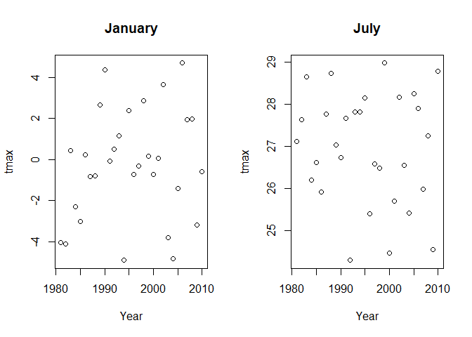
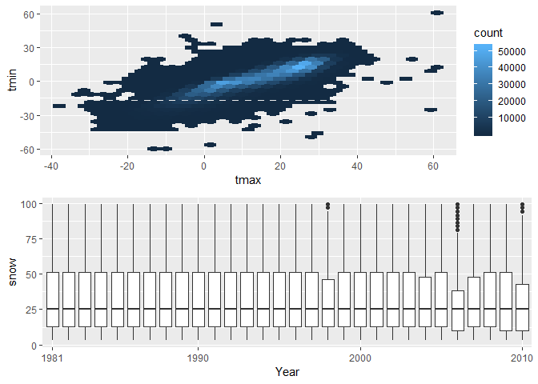

HW3\_Markdown
================
Noah Kreski
October 12, 2018

Problem One
===========

``` r
#This imports the data and cleans the names.
BRFSS_Cleaned = janitor::clean_names(brfss_smart2010)%>%
                #The next two lines focus on overall health and entries with one of five relevant response levels.
                filter(topic == "Overall Health")%>%
                filter(response %in% c("Excellent", "Very good", "Good", "Fair", "Poor"))%>%
                #This creates an ordered factor of response levels.
                mutate(response = (factor (response, levels = c("Excellent", "Very good", "Good", "Fair", "Poor"))))
```

### In 2002, which states were observed at 7 locations?

``` r
#This gets the 2002 entries.
filter(BRFSS_Cleaned, year == 2002)%>%
#This includes a single datum for each location
distinct(locationdesc,.keep_all = TRUE)%>%
#These two lines tell us how many locations exist by state
group_by(locationabbr)%>%
summarize(n = n())
```

    ## # A tibble: 49 x 2
    ##    locationabbr     n
    ##    <chr>        <int>
    ##  1 AK               1
    ##  2 AL               1
    ##  3 AR               1
    ##  4 AZ               2
    ##  5 CA               1
    ##  6 CO               4
    ##  7 CT               7
    ##  8 DC               1
    ##  9 DE               3
    ## 10 FL               7
    ## # ... with 39 more rows

The states observed at 7 locations in 2002 are Connecticut, Florida, and North Carolina

### Make a “spaghetti plot” that shows the number of locations in each state from 2002 to 2010.

``` r
BRFSS_Spaghetti = BRFSS_Cleaned%>%
                  #This includes all unique locations by year
                  distinct(year,locationdesc,.keep_all = TRUE)%>%
                  #These two lines tell us how many locations exist by state and year
                  group_by(year,locationabbr)%>%
                  summarize(n = n())
ggplot(data = BRFSS_Spaghetti, aes(x=year, y=n, group=locationabbr, color = locationabbr)) + geom_line()
```


This spaghetti plot tracks the number of observations by year and state.

### Make a table showing, for the years 2002, 2006, and 2010, the mean and standard deviation of the proportion of “Excellent” responses across locations in NY State.

``` r
#Th sese two steps will isolate the years needed and limit data to excellent responses across NY
filter(BRFSS_Cleaned, year %in% c(2002, 2006, 2010))%>%
filter(response == "Excellent", locationabbr == "NY")%>%
#This sets up the data for exploratory summarization, and the production of a mean and standard deviation
group_by(year)%>%
summarize(mean_excellent = mean(data_value), sd_excellent = sd(data_value))
```

    ## # A tibble: 3 x 3
    ##    year mean_excellent sd_excellent
    ##   <int>          <dbl>        <dbl>
    ## 1  2002           24.0         4.49
    ## 2  2006           22.5         4.00
    ## 3  2010           22.7         3.57

### For each year and state, compute the average proportion in each response category (taking the average across locations in a state). Make a five-panel plot that shows, for each response category separately, the distribution of these state-level averages over time

``` r
#Getting a data set with a proportion for each response level by state and year
BRFSS_Five= BRFSS_Cleaned%>%
            group_by(year, locationabbr, response)%>%
            summarize(mean_response = mean(data_value))%>%
            group_by(year, response)
#I am setting up a 5 plot panel
par(mfrow=c(2,3))
par(mar=c(3,2,1,2))
#These boxplots graph each response level over time.
boxplot(mean_response~year,filter(BRFSS_Five, response == "Excellent"), main = "Excellent")
boxplot(mean_response~year,filter(BRFSS_Five, response == "Very good"), main = "Very Good")
boxplot(mean_response~year,filter(BRFSS_Five, response == "Good"), main = "Good")
boxplot(mean_response~year,filter(BRFSS_Five, response == "Fair"), main = "Fair")
boxplot(mean_response~year,filter(BRFSS_Five, response == "Poor"), main = "Poor")
```


Problem Two
===========

### Write a short description of the dataset, noting the size and structure of the data, describing some key variables, and giving illstrative examples of observations

This data, with 1,384,617 rows and 15 columns, articulates information about grocery shopping behavior. Key variables include aisle, which describes the location of an item, and product\_id, which gives a numeric code for a purchased product. For instance, order\_id 1 included items such as Bulgarian Yogurt and Organic 4% Milk Fat Whole Milk, both in the department 'dairy eggs'. Additionally, I know the hour of day during this order was 10 am, that it has been 9 days since the last order, and that yogurt was added to the cart first.

### How many aisles are there, and which aisles are the most items ordered from?

``` r
#These three lines generate the number of observations for every aisle, and by extension, includes every aisle as a row. 
instacart%>%
group_by(aisle)%>%
summarize(obs=n())
```

    ## # A tibble: 134 x 2
    ##    aisle                    obs
    ##    <chr>                  <int>
    ##  1 air fresheners candles  1067
    ##  2 asian foods             7007
    ##  3 baby accessories         306
    ##  4 baby bath body care      328
    ##  5 baby food formula      13198
    ##  6 bakery desserts         1501
    ##  7 baking ingredients     13088
    ##  8 baking supplies decor   1094
    ##  9 beauty                   287
    ## 10 beers coolers           1839
    ## # ... with 124 more rows

``` r
#This code matches the above, but then isolates the 5 most common/popular aisles.
instacart%>%
group_by(aisle)%>%
summarize(obs=n())%>%
top_n(n=5)
```

    ## Selecting by obs

    ## # A tibble: 5 x 2
    ##   aisle                         obs
    ##   <chr>                       <int>
    ## 1 fresh fruits               150473
    ## 2 fresh vegetables           150609
    ## 3 packaged cheese             41699
    ## 4 packaged vegetables fruits  78493
    ## 5 yogurt                      55240

This summarization code provides a summary with 134 rows, one for each aisle, so there are 134 aisles. The 5 most popular aisles are fresh fruits, fresh vegetables, packaged cheese, packages vegetables & fruits, and yogurt, the number one aisle being fresh vegetables.

### Make a plot that shows the number of items ordered in each aisle. Order aisles sensibly, and organize your plot so others can read it.

``` r
#These three lines create a data set with the number of items per aisle, ready for plotting
instacart_summary_data = instacart%>%
                         group_by(aisle_id)%>%
                         summarize(obs=n())
#These lines generate the plot with aisle in numerical order, and appropriate labels
ggplot(instacart_summary_data, aes(x = aisle_id, y = obs)) + 
  geom_point() + labs(title = "Items Ordered per aisle", x = "Aisle", y = "Orders")
```


### Make a table showing the most popular item in each of the aisles “baking ingredients”, “dog food care”, and “packaged vegetables fruits”.

``` r
#These two steps isolate the aisles of interest and group by aisle and product name for analyses
filter(instacart, aisle %in% c("baking ingredients", "dog food care", "packaged vegetables fruits"))%>%
group_by(aisle, product_name)%>%
#These remaining steps generate a sample size per product, groups by aisle, and generates the most common product in each category
count(product_name)%>%
group_by(aisle)%>%
top_n(1)
```

    ## Selecting by n

    ## # A tibble: 3 x 3
    ## # Groups:   aisle [3]
    ##   aisle                    product_name                                  n
    ##   <chr>                    <chr>                                     <int>
    ## 1 baking ingredients       Light Brown Sugar                           499
    ## 2 dog food care            Snack Sticks Chicken & Rice Recipe Dog T~    30
    ## 3 packaged vegetables fru~ Organic Baby Spinach                       9784

The most common product purchased in the aisles baking ingredients, dog food care, and packaged vegetables fruits are as follows: Light Brown Sugar, Snack Sticks Chicken & Rice Recipe Dog Treats, and Organic Baby Spinach.

### Make a table showing the mean hour of the day at which Pink Lady Apples and Coffee Ice Cream are ordered on each day of the week; format this table for human readers (i.e. produce a 2 x 7 table).

``` r
#These two lines limit the data to the two products of interest, and then group by product and day of week
filter(instacart, product_name %in% c("Pink Lady Apples", "Coffee Ice Cream"))%>%
group_by(product_name, order_dow)%>%
#These two lines generate a mean hour of the day for each day of the week and product, before creating a more readable 2x7 table
summarize(mean_hour = mean(order_hour_of_day))%>%
spread(key=order_dow, value=mean_hour)
```

    ## # A tibble: 2 x 8
    ## # Groups:   product_name [2]
    ##   product_name       `0`   `1`   `2`   `3`   `4`   `5`   `6`
    ##   <chr>            <dbl> <dbl> <dbl> <dbl> <dbl> <dbl> <dbl>
    ## 1 Coffee Ice Cream  13.8  14.3  15.4  15.3  15.2  12.3  13.8
    ## 2 Pink Lady Apples  13.4  11.4  11.7  14.2  11.6  12.8  11.9

The above table shows the mean hour of the day for each day of the week, per product. While we can assume 0 is Sunday here, without this explicit information, this table remains an accurate representation of the necessary data.

Problem Three
=============

### Do some data cleaning. Create separate variables for year, month, and day. Ensure observations for temperature, precipitation, and snowfall are given in reasonable units. For snowfall, what are the most commonly observed values? Why?

``` r
ny_noaa_cleaned = ny_noaa%>%
                  #This separates the date variable into relevant categories.
                  separate(date, c("Year", "Month", "Day"), sep = "-")%>%
                  #This converts from tenths of mm to full millimeters, and from tenths of degrees Celsius to full degrees.
                  mutate(prcp = prcp/10, tmax = as.numeric(tmax)/10, tmin = as.numeric(tmin)/10)
#This Checks the most common snowfall values
ny_noaa_cleaned%>%
count(snow)%>%
top_n(2)
```

    ## Selecting by n

    ## # A tibble: 2 x 2
    ##    snow       n
    ##   <int>   <int>
    ## 1     0 2008508
    ## 2    NA  381221

The most common answers for amount of snowfall are 0, as many places don't get any snow, and NA, as many places just do not document this.

### Make a two-panel plot showing the average max temperature in January and in July in each station across years. Is there any observable / interpretable structure? Any outliers?

``` r
maxt= ny_noaa_cleaned%>%
      filter(Month %in% c("01", "07"))%>%
      group_by(Year, Month)%>%
      summarise(tmean = mean(tmax, na.rm = TRUE))
par(mfrow = c(1,2))
      plot(filter(maxt, Month == "01")$Year, filter(maxt, Month == "01")$tmean, xlab = "Year", ylab = "tmax", main = "January")
      plot(filter(maxt, Month == "07")$Year, filter(maxt, Month == "07")$tmean, xlab = "Year", ylab = "tmax", main = "July")
```



The above plots show the change in mean maximum temperature over the years for January and July. Any patterns are difficult to discern from this visualization alone, and further analysis may be necessary. Outliers, such as a uniquely low 1994 January temperature or uniquely low 2009 July temperature, do exist.

### Make a two-panel plot showing (i) tmax vs tmin for the full dataset (note that a scatterplot may not be the best option); and (ii) make a plot showing the distribution of snowfall values greater than 0 and less than 100 separately by year.

``` r
require(hexbin)
```

    ## Loading required package: hexbin

``` r
library(grid)
library(gridExtra)
```

    ## 
    ## Attaching package: 'gridExtra'

    ## The following object is masked from 'package:dplyr':
    ## 
    ##     combine

``` r
plotX <- ggplot(ny_noaa_cleaned, aes(x = tmax, y = tmin)) + geom_hex()
plotY <-ggplot(filter(ny_noaa_cleaned, snow > 0 & snow < 100), aes(x = Year, y = snow)) + geom_boxplot()+scale_x_discrete(breaks = c("1981", "1990", "2000", "2010"))

grid.arrange(plotX, plotY)
```


